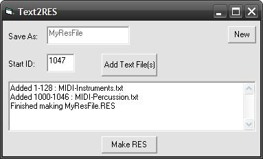



## Text2RES \- Resource String Table Maker

### Description

This little utility takes text file(s) and make a string table resource file (.RES). A string table in a resource file can be very useful but difficult to make using VB Resource Editor as it cannot import text files nor allow you to copy and paste text!  

IMPORTANT: This utility uses rc.exe and rcdll.dll that comes with VB6. It should be in the Wizards directory of VB6 if you installed the all extras with VB. You will likely have to modify the path to rc.exe as I have hard-coded it in the program. Look for it in the zip if you need it. 

[UPDATE May 2 2011] Fixed an issue with commas in text files being split to a seperate ID [UPDATE Aug 25 2011] Minor program changes, layout, comments, etc
 
### More Info
 

             |
---                |---
**Submitted On**   |2011-08-25 13:25:26
**By**             |[Paul Bahlawan](https://github.com/Planet-Source-Code/PSCIndex/blob/master/ByAuthor/paul-bahlawan.md)
**Level**          |Beginner
**User Rating**    |5.0 (20 globes from 4 users)
**Compatibility**  |VB 6\.0
**Category**       |[Complete Applications](https://github.com/Planet-Source-Code/PSCIndex/blob/master/ByCategory/complete-applications__1-27.md)
**World**          |[Visual Basic](https://github.com/Planet-Source-Code/PSCIndex/blob/master/ByWorld/visual-basic.md)
**Archive File**   |[Text2RES\_\-2210108252011\.zip](https://github.com/Planet-Source-Code/paul-bahlawan-text2res-resource-string-table-maker__1-73880/archive/master.zip)

